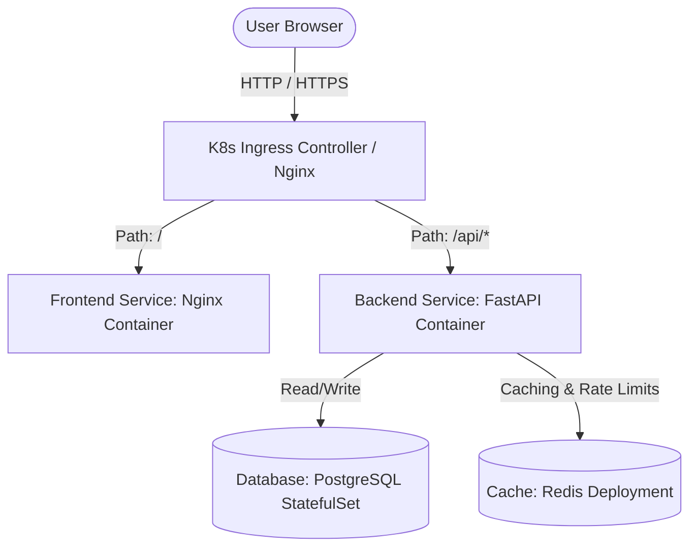

# Ottoke — Rate My Suffering 😭

[](https://kubernetes.io/)
[](https://helm.sh/)
[](https://argoproj.github.io/cd/)
[](https://fastapi.tiangolo.com/)
[](LICENSE)

**Ottoke** ("*What to do?!*" in Korean) is a production-grade, 3-tier open-source web application where users can anonymously submit workplace confessions and rate others' suffering. 

Designed as a cloud-native training sandbox, the project demonstrates modern software engineering and DevOps patterns—ranging from simple local SQLite scripting to Docker Compose orchestration, Helm Chart packaging, and fully automated GitOps delivery using ArgoCD.

---

## 🏗️ Architecture & Deployment Modes

The application supports multiple run modes depending on your scale and learning path:

### 1. Monolithic Mode (2-Tier Local Development)
FastAPI serves the static assets directly and handles JSON API endpoints locally, writing to a single, file-based SQLite database (`ottoke.db`).

### 2. Orchestrated Mode (3-Tier Docker Compose)
Decouples the frontend static server, backend application logic, and storage. Uses **Nginx** for frontend delivery and reverse proxying, **FastAPI** for core logic, **PostgreSQL** for relational storage, and **Redis** for state caching/rate limiting.

### 3. Cloud-Native Mode (Kubernetes, Helm, & ArgoCD)
Production-grade deployment orchestrated inside a Kubernetes cluster (e.g., **Kind**, **Minikube**). Implements **StatefulSets** with Persistent Volume Claims (PVC) for database storage, Ingress controllers for path-based routing, Helm Charts for configuration packaging, and **ArgoCD** for automated continuous deployment (GitOps).



---

## 🔒 Security Hardening

Ottoke is built with security-first design patterns:
*   **SQL Injection Prevention**: Absolute separation of queries and data via parameterized inputs using Python DB-APIs (`%s` for PostgreSQL, `?` for SQLite).
*   **Cross-Site Scripting (XSS) Prevention**: Frontend input sanitization, safe client-side DOM assignments (`textContent` instead of `innerHTML`), and backend output sterilization (`html.escape`).
*   **Memory-based Rate Limiting**: Time-windowed IP rate limits (5 submissions, 10 votes, 10 comments per hour) managed atomically using high-speed Redis memory keys, preventing database DDoS attacks.
*   **Unprivileged Containers**: Frontend and Backend Dockerfiles utilize system users (`nginx` / `appuser`) rather than root, minimizing the potential impact of container breakout attacks.

---

## 🚀 Local Development Quickstart

Ensure you have [Git](https://git-scm.com/) and [Docker Desktop](https://www.docker.com/products/docker-desktop/) installed.

### Option A: Running with Docker Compose (3-Tier PostgreSQL + Redis)
*This is the recommended local dev setup, matching the production environment architecture.*

1. **Clone the repository**:
   ```bash
   git clone https://github.com/Hritikraj8804/ottoke.git
   cd ottoke
   ```
2. **Configure Environment Variables**:
   Copy `.env.example` into a new `.env` file:
   ```bash
   cp .env.example .env
   ```
   Modify values if needed (the defaults work out of the box).
3. **Build & Spin Up**:
   ```bash
   docker compose up --build
   ```
4. **Access the Web UI**:
   Open 👉 **[http://localhost:8000](http://localhost:8000)** in your browser.
5. **Teardown**:
   ```bash
   docker compose down -v
   ```

### Option B: Running Natively (SQLite Monolith Mode)
*Best for rapid FastAPI code debugging without running container engines.*

1. **Setup Python Virtual Environment (Python 3.11+)**:
   ```bash
   python -m venv venv
   # On Windows (PowerShell):
   .\venv\Scripts\Activate.ps1
   # On macOS/Linux:
   source venv/bin/activate
   ```
2. **Install Dependencies**:
   ```bash
   pip install -r requirements.txt
   ```
3. **Initialize the SQLite Database**:
   ```bash
   python scripts/seed_db.py
   ```
4. **Start the FastAPI Development Server**:
   ```bash
   uvicorn api.index:app --reload
   ```
5. **Access the app** at 👉 **[http://localhost:8000](http://localhost:8000)**.

---

## ☸️ Kubernetes & GitOps Deployment

For production deployments, the application manifests are organized for Kubernetes.

### Local Kubernetes Cluster Setup (Kind)
To spin up a local Kubernetes cluster optimized for this project:

1. **Create Kind Cluster with Port Mappings**:
   ```bash
   kind create cluster --name ottoke --config k8s/kind-config.yaml
   ```
2. **Deploy Nginx Ingress Controller**:
   ```bash
   kubectl apply -f https://raw.githubusercontent.com/kubernetes/ingress-nginx/main/deploy/static/provider/kind/deploy.yaml
   ```
3. **Verify Cluster Readiness**:
   ```bash
   kubectl get pods -n ingress-nginx
   ```

### Option C: Raw Manifests Deployment
Apply all configurations in the `k8s/` folder:
```bash
kubectl apply -f k8s/
```
Once healthy, navigate directly to **`http://localhost/`** (routed through Ingress host mappings).

### Option D: Helm Chart Deployment
The project contains a customizable Helm Chart located in `helm/ottoke/`.

1. **Dry-run & Template Rendering**:
   ```bash
   helm template ottoke ./helm/ottoke -f ./helm/ottoke/values.yaml
   ```
2. **Install the Chart**:
   ```bash
   helm install ottoke ./helm/ottoke -n ottoke --create-namespace
   ```
3. **Upgrade Releases**:
   ```bash
   helm upgrade ottoke ./helm/ottoke -n ottoke
   ```

### Option E: GitOps Automation (ArgoCD)
With GitOps, cluster synchronization is fully declared via Git.

1. **Install ArgoCD**:
   ```bash
   kubectl create namespace argocd
   kubectl apply -n argocd -f https://raw.githubusercontent.com/argoproj/argo-cd/stable/manifests/install.yaml
   ```
2. **Deploy the GitOps Application controller**:
   ```bash
   kubectl apply -f argocd-app.yaml
   ```
3. ArgoCD will track the `main` branch of this repository and automatically sync PostgreSQL StatefulSets, Redis Deployments, Nginx Frontend servers, and routing rules in the `ottoke` namespace.

---

## 🐣 Easter Eggs

*   **Konami Code**: Go to the Feed or Leaderboard pages, and type `Up Up Down Down Left Right Left Right B A` on your keyboard to toggle **K-Drama Mode**!
*   **The 3:33 Blessing**: Submitting a rating at exactly 3:33 PM local time unlocks a special blessing from the drama gods in the console logs.

---

## 🤝 Contributing

We welcome contributions from the community! Whether you are a developer looking to code, a DevOps engineer optimizing the Helm configurations, or a writer improving instructions, check out our **[Contributing Guide](file:///c:/Users/hriti/project/Ottoke/CONTRIBUTING.md)** to get started.

---

## 📄 License

This project is licensed under the MIT License - see the LICENSE file for details.
